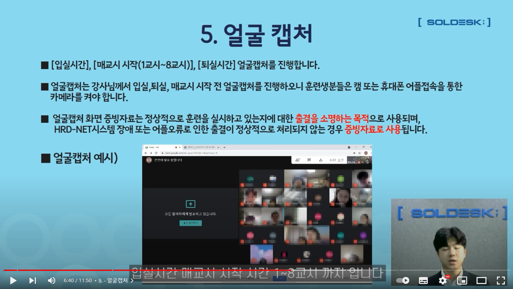

# AAMP

> AAMP, 자율 출석 관리 플랫폼
출석 체크 시, 낭비되는 시간을 최소화하고자 제작되었습니다.
> 

## 프로젝트 계획 이유

### 현재의 출석 체크 과정

> 출석 체크 시 낭비되는 시간이 매우 많다고 느꼈습니다.

매 교시의 출석 체크 과정이 1분씩 소요된다면 **16시간, 약 2일 분량의 수업 시간이 출석 체크를 하느라 낭비됩니다**(6개월간 주 5일 8교시 수업 기준).

다만 이는 학생들의 접속 지연 요인을 배제 하였을 때의 얘기고, 여러 현실적인 요인으로 인해 실제로는 훨씬 더 걸릴 때도 있습니다.

예를 들어, 학생 한 명이 부득이한 사정으로 2분간 출석 체크를 지연 시켰다면, 나머지 학생들이 기다리느라 불필요한 대기를 할 수 밖에 없는 현실입니다. 불필요하게 스트리밍 되어 낭비되는 모바일 데이터도 있고요.

현재 국비 지원 직업 훈련의 출석 체크 과정은 다음과 같습니다:
> 
> 1. 수업 시작 시, 학생들은 줌 채팅방에 전원 참석
> 2. 화면 캡처. 캡처에는 학생들의 얼굴과 캡처 시간이 나와야 함
> 3. 강사님이 캡처된 이미지 보관
> 
> 저희가 찾은 문제점은 다음과 같습니다:
>